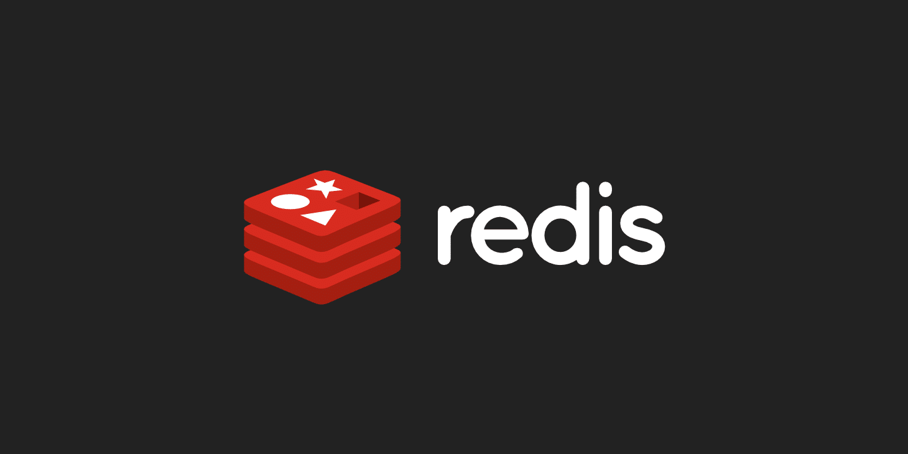

# Redis


## This is Redis App To Cach Github Projects :



 **Technology** : *Node js , Express , Redis , Fetch. *


> install dependencies and run the project
 ```javascript
  npm install
  npm run dev
 ```
 
> run redis
 ```bash
 	redis-cli
 ```
